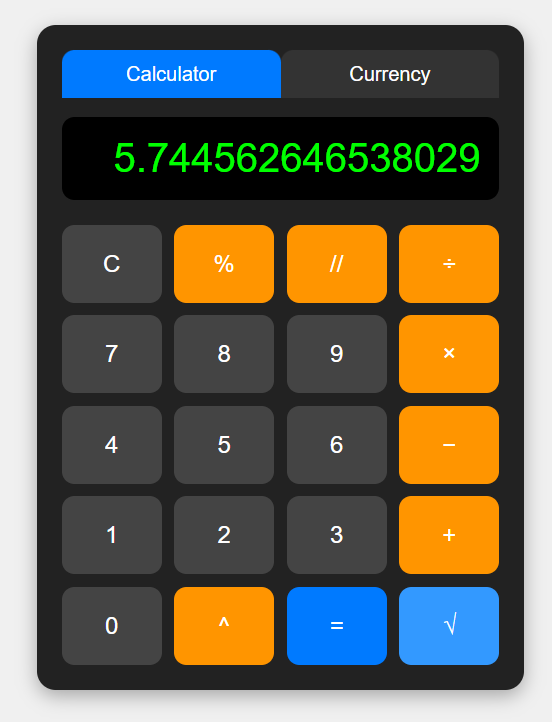

# 🧮 Smart Calculator
A sleek, browser-based calculator that goes beyond basic arithmetic — combining everyday calculations with a built-in currency converter.
**🔗 Live Demo:** [calculator-project-qt.netlify.app](https://calculator-project-qt.netlify.app/)
## ✨ Features
- **Standard arithmetic** — addition, subtraction, multiplication, division
- **Advanced operations** — percentage (%), power (^), square root (√), integer division (//)
- **Currency converter** — convert between USD, EUR, GBP, and QAR right inside the calculator
- **Clean, responsive UI** — works smoothly on desktop and mobile
- **Instant results** — no page reloads, everything calculates in real time
## 🛠️ Built With
- HTML5
- CSS3
- JavaScript (Vanilla)
- Deployed on [Netlify](https://www.netlify.com/)
## 🧠 Development Process
This calculator was originally built and tested in **Python**, working out the core logic for the arithmetic and conversion features. It was then converted into a web app, using AI assistance to design the UI and translate the logic into HTML, CSS, and JavaScript.
## 📸 Preview of example trying out the calculator:

## 📄 License
This project is licensed under the MIT License - see the [LICENSE](LICENSE) file for details.
## 🙋 Author
Made by [facxts](https://github.com/facxts)
